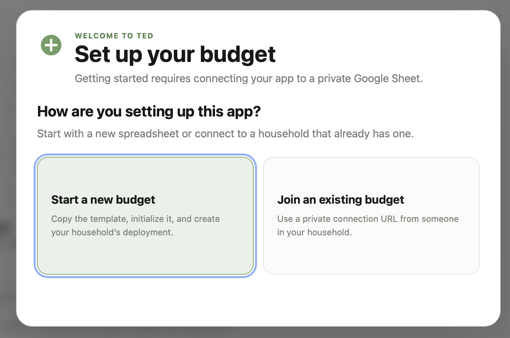

# Track Every Dollar

Track Every Dollar (or TED for short) provides a front end wrapper around Google Sheets for budgeting and financial management.

Spreadsheets have long been the go to choice for people tracking their finances, but data entry can be cumbersome for those not used to working with the format. TED removes the need for understanding sheets and formulas and instead provides you with a simple interface to see everything you need.

V1 of the app is currently split into two main features...Budgeting and Investments.

### Budgeting

At the core of tracking every dollar is logging every transaction you make.

You will track how much you paid, who you paid, and what category it falls into. This will then let you see exactly where your money is going. And in a future release, we will allow you to set targets for categories and vendors so that you can adjust your spending habits with accountability.

### Investments

Every investment account you have can be added. You will track your total contributions to each account and the balance at the end of the month. This will let you see your growth and rate of return over time.

Future releases will let you set investment targets and calculate how much time is left until you can retire based on your current balance.

## Starting a new spreadsheet

If you are starting a new spreadsheet from scratch, you will need to go through the following steps.

1. When you first open the app, you will be presented with an onboarding screen. Select the option to "Start a new budget".

<table>
    <tr>
        <td width="50%"></td>
    </tr>
</table>

2. This will bring you into the onboarding process for a new spreadsheet. The first step here is to make a copy of the spreadsheet template. The spreadsheet will be where all your data is stored. And because it is on Google Sheets, you can inspect it at any time.

   Hit the button to "Open the spreadsheet template".

   This will take you to a screen asking if you would like to copy the document and the App Script file associated with it. The App Script is what connects TED to the spreadsheet.

   Click "Make a copy". This will open your spreadsheet and save it to your Google Drive. You can rename it to whatever you want and move it around in your Drive as needed.

<table>
    <tr>
        <td width="50%"></td>
        <td width="50%"></td>
    </tr>
</table>

3. Inside the spreadsheet, look to the right hand side and you should see a menu called "Track Every Dollar".

   Click on it and select "Set up budget". You will receive an alert asking for authorization to run a script. Click ok on the alert.

<table>
    <tr>
        <td width="50%"></td>
         <td width="50%"></td>
        
    </tr>
</table>

4. This will open a window saying Google has not verified this app. This occurs for all apps created privately.

   Click "Advanced" and then select "Go to Personal Finance Tracker (unsafe)".

   You will then get a confirmation screen asking to allow the script access to your Google account. This is necessary for the app to insert and edit entries to the spreadsheet as you add data. And despite it saying it can See, Edit, and Delete all of your Google Sheets, there is no code that allows that to happen. It only gets access to the TED sheet.

   Click "Continue".

   This should bring you back to the spreadsheet and show you a confirmation that the budget has been intialized.

<table>
    <tr>
        <td width="50%"></td>
         <td width="50%"></td>  
    </tr>
</table>

5. Once you click Continue, you should be brought back to the spreadsheet and see a confirmation that the budget has been intialized.

<table>
    <tr>
        <td width="50%"></td>
    </tr>
</table>

## CSV imports

Open **Import** from the Budgeting navigation to upload a CSV, select or create a reusable profile, map its columns, and review staged rows. Budget mapping can optionally reuse source Vendor, Category, and Person names, staging any missing records for the final commit. Exact saved profile matches jump directly to review. Investment imports map one ending balance plus any number of contribution/withdrawal columns into the existing monthly account model.

CSV files are parsed entirely in the browser and staging is discarded on refresh. Profiles, mappings, new reference records, and rows remain in memory until **Commit import**. The progress view creates dependencies in order, queues records through the existing local-first Sync workflow, and reports completion only after every selected row is confirmed in Google Sheets. Writes remain limited to batches of 50.

After updating an existing Google Sheet backend, replace both Apps Script source files, run **Track Every Dollar → Set up budget** once to create `ImportProfiles`, `ImportVendorMappings`, and `ImportPersonMappings`, then publish a new web-app deployment version. Existing normalized data is preserved.
