# Track Every Dollar

Track Every Dollar (or TED for short) provides a front end wrapper around Google Sheets for budgeting and financial management.

To download the app to your computer, find "Releases" on the right side bar and click on the latest release. Once you are there, you should see a "Source code" file that you can download as a zip file.

Download it to your computer, unzip it, and move the new folder into your applications folder. You are welcome to put the folder wherever you like, but applications makes the most sense.

You will access the app by opening the index.html file.

I suggest right clicking on the index file and creating an alias. This creates a linked file that you can name whatever you want and move wherever you want without touching the source code. I created an alias, named it TED, and put it in my applications folder for quick access.

## Starting a new spreadsheet

If you are starting a new spreadsheet from scratch, you will need to set up the TED spreadsheet and connect it to Google's App Script so that your app can read and write data. The onboarding screens will walk you through the process, but you can also use the steps below.

1. When you first open the app, you will be presented with an onboarding screen. Select the option to "Start a new budget".

<table>
    <tr>
        <td width="50%"></td>
    </tr>
</table>

2. This will bring you into the onboarding process for a new spreadsheet. The first step here is to make a copy of the spreadsheet template. The spreadsheet will be where all your data is stored. And because it is on Google Sheets, you can inspect it at any time.

   Hit the button to "Open the spreadsheet template".

   This will take you to a screen asking if you would like to copy the document and the App Script file associated with it. The App Script is what connects TED to the spreadsheet.

   Click "Make a copy". This will open your spreadsheet and save it to your Google Drive. You can rename it to whatever you want and move it around in your Drive as needed.

<table>
    <tr>
        <td width="50%"></td>
        <td width="50%"></td>
    </tr>
</table>

3. Inside the spreadsheet, look to the right hand side and you should see a menu called "Track Every Dollar".

   Click on it and select "Set up budget". You will receive an alert asking for authorization to run a script. Click ok on the alert.

<table>
    <tr>
        <td width="50%">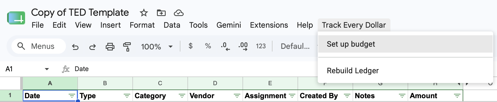</td>
         <td width="50%">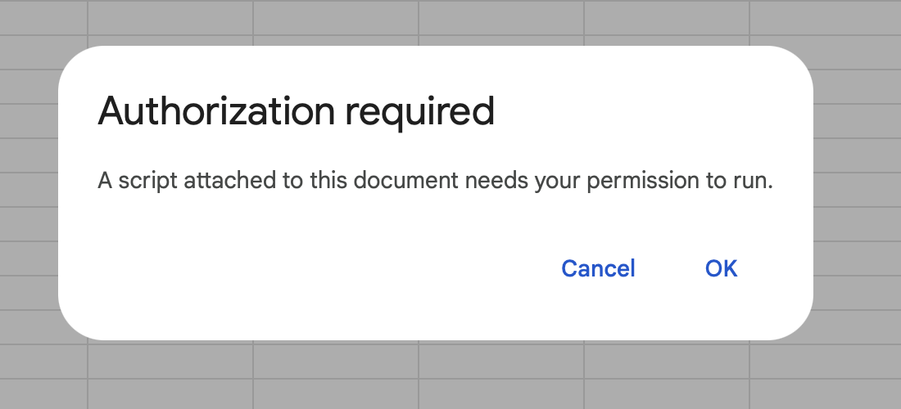</td>
    </tr>
</table>

4. This will open a window saying Google has not verified this app. This occurs for all apps created privately.

   Click "Advanced" and then select "Go to Personal Finance Tracker (unsafe)".

   You will then get a confirmation screen asking to allow the script access to your Google account. This is necessary for the app to insert and edit entries to the spreadsheet as you add data. And despite it saying it can See, Edit, and Delete all of your Google Sheets, there is no code that allows that to happen. It only gets access to the TED sheet. Click "Continue".

<table>
    <tr>
        <td width="50%"></td>
         <td width="50%">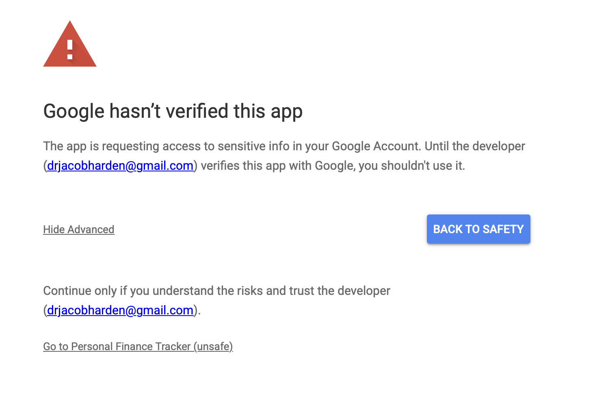</td>  
    </tr>
</table>

5. Once you click Continue, you should be brought back to the spreadsheet and see a confirmation that the budget has been intialized.

<table>
    <tr>
        <td width="50%">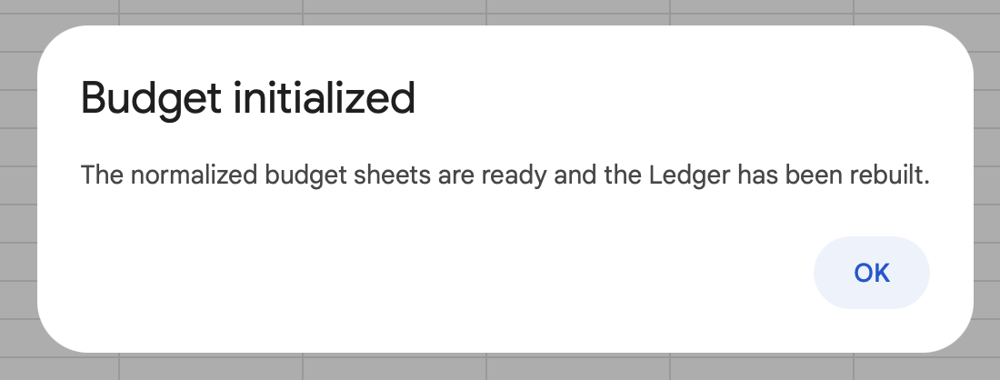</td>
    </tr>
</table>

6. Back in the spreadsheet, find the "Extensions" menu and select "App Scripts".

   This will take you to the App Script page. This is the code that lets TED talk to your spreadsheet. Hit "Deploy" in the top right and select "New deployment". This will create your personal version of the app code and link it to your spreadsheet.

<table>
    <tr>
        <td width="50%">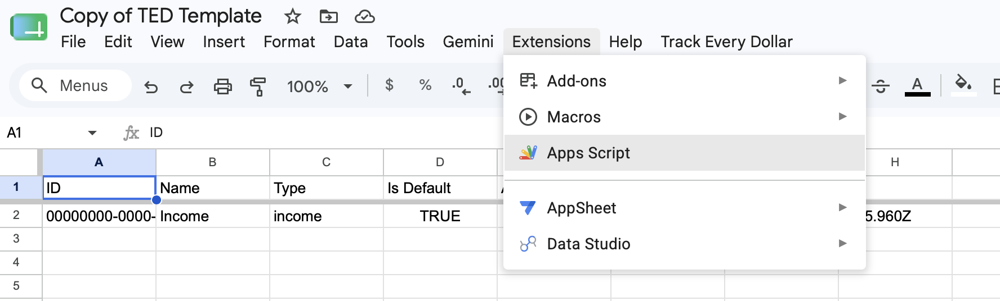</td>
         <td width="50%">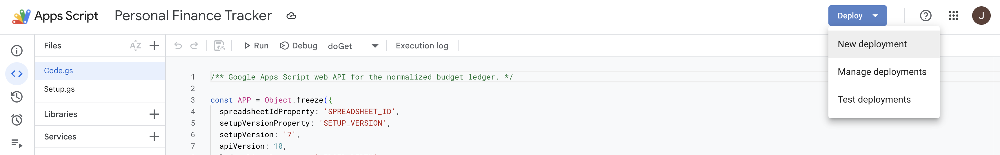</td>
    </tr>
</table>

7. This will bring up a window where you will configure the script. Make sure "Web App" is selected for the deployment type. If it is not, use the gear icon to select it. Set "Execute as" to "Me" and set "Who has access" to "Anyone". This will let your TED app speak to the sheet.

   Once you have the settings correct, hit "Deploy".

<table>
    <tr>
        <td width="50%">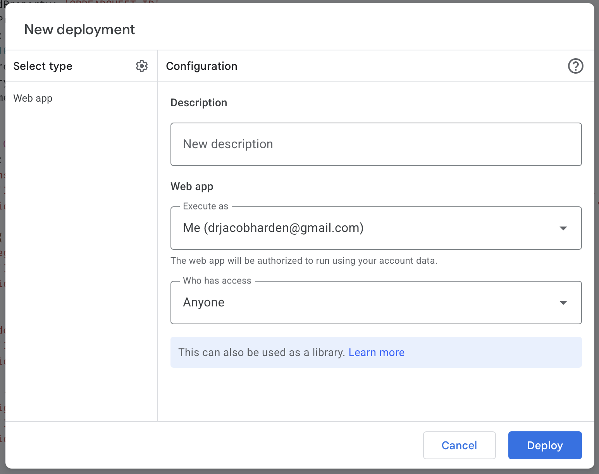</td>
         <td width="50%">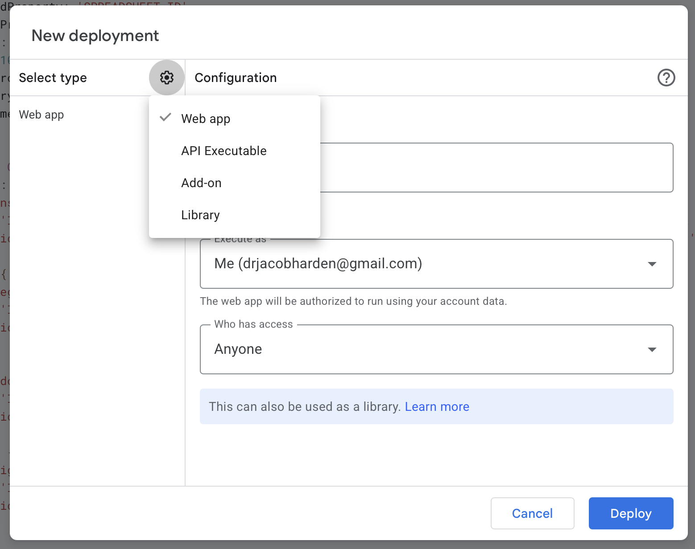</td>
    </tr>
</table>

8.  The script will be connected to your spreadsheet and you will be shown a confirmation with a URL. Copy this URL.

    Back in the TED app, walk through the onboarding steps if you haven't done so already until you get to a screen asking you to enter the Web App URL. Paste in the URL which you copied. Then click "Test and connect".

<table>
    <tr>
         <td width="50%">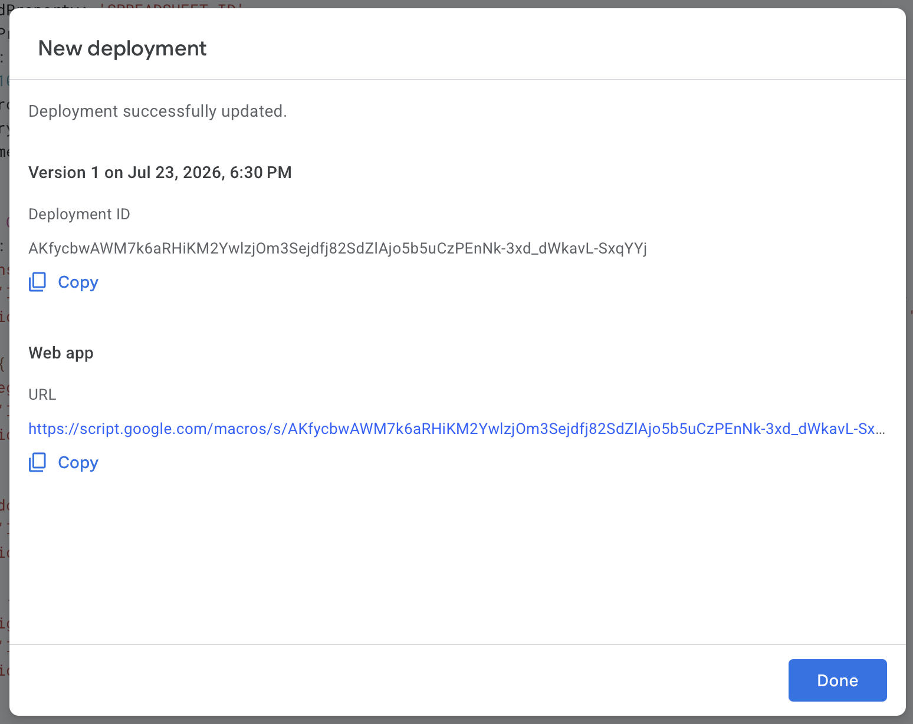</td>
        <td width="50%">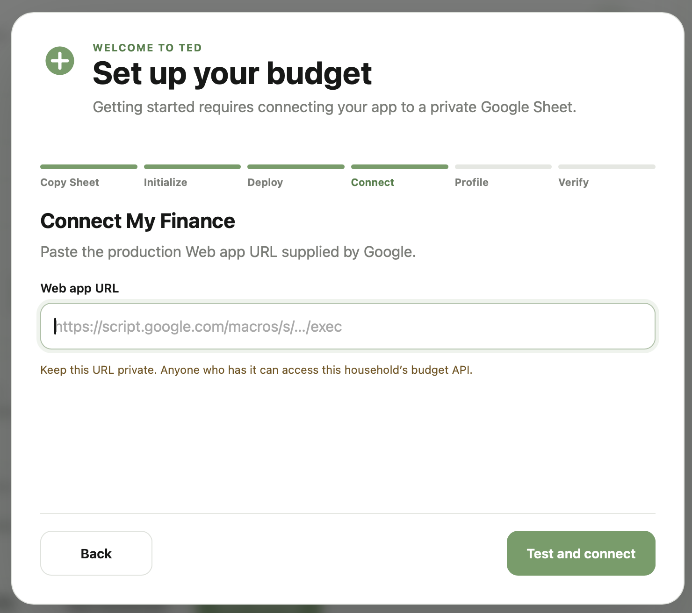</td>
    </tr>
</table>

9. If connection was successful, you will be asked to create your profile. Enter your first and last name. This is used to keep track of which transactions you log into the system.

   Once you create your profile, you will be asked to look in the spreadsheet under the Accounts tab and confirm that your name was entered correctly. If it was, check the box and click "Finish setup".

<table>
    <tr>
         <td width="50%">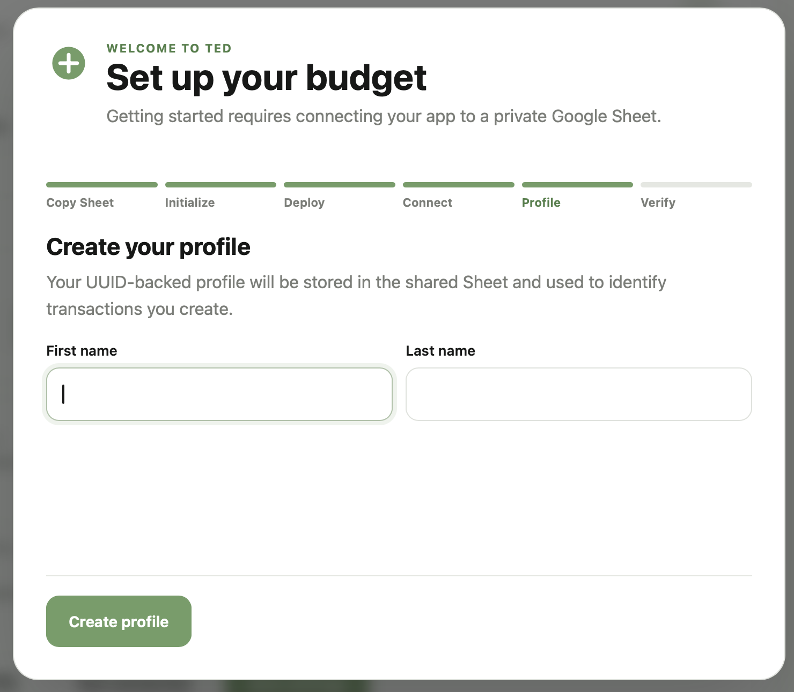</td>
        <td width="50%">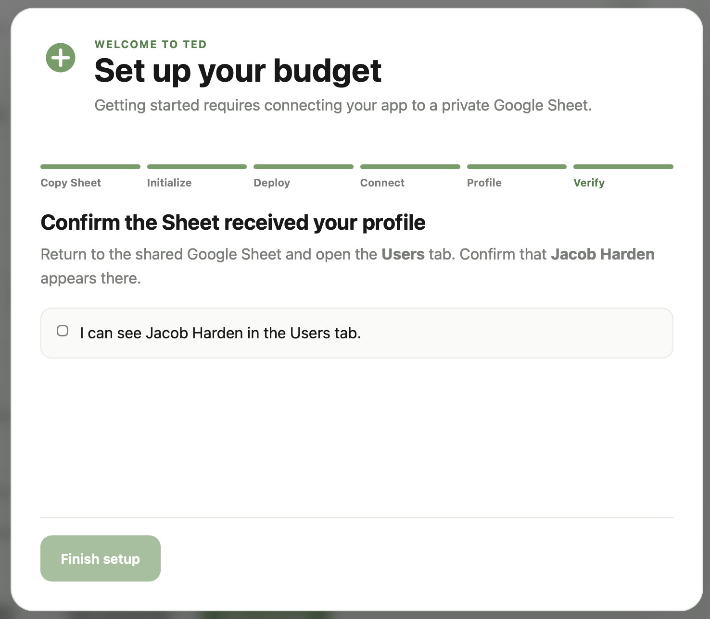</td>
    </tr>
</table>

## Sharing your sheet with others

TED fully supports collaboration and multiple household members entering and editing data. All they need is a copy of the TED app on their computer and the link to your spreadsheet.

1. Once you have TED downloaded and open, click "Join existing budget" in the first onboarding step.

   You will be asked to enter the URL for web app connected to your spreadsheet. If you have access to the spreadsheet, this can be found at
   Extensions -> App Scripts -> Deploy -> Manage Deployments

   If you don't have access to the spreadsheet, have the sheet owner send you the URL so you can copy it in.

<table>
    <tr>
         <td width="50%">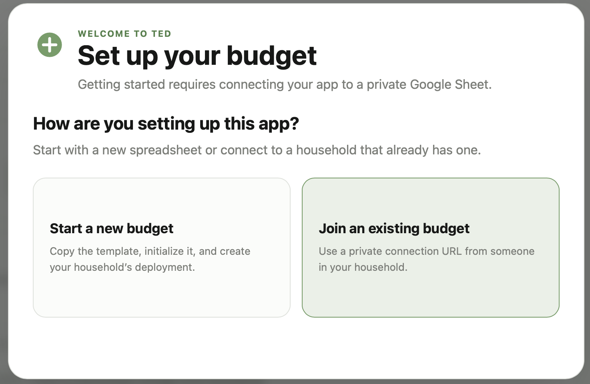</td>
         <td width="50%">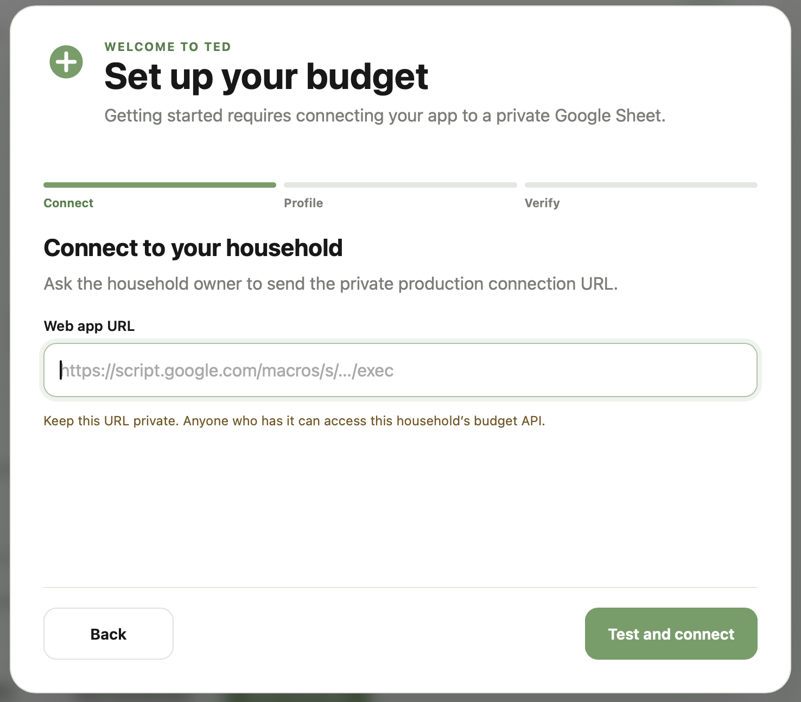</td>
    </tr>
</table>

2. If connection was successful, you will be asked to create your profile. Enter your first and last name. This is used to keep track of which transactions you log into the system.

   Once you create your profile, you will be asked to look in the spreadsheet under the Accounts tab and confirm that your name was entered correctly. If it was, check the box and click "Finish setup".

<table>
    <tr>
         <td width="50%"></td>
        <td width="50%"></td>
    </tr>
</table>

## CSV imports

Open **Import** from the Budgeting navigation to upload a CSV, select or create a reusable profile, map its columns, and review staged rows. Budget mapping can optionally reuse source Vendor, Category, and Person names, staging any missing records for the final commit. Exact saved profile matches jump directly to review. Investment imports map one ending balance plus any number of contribution/withdrawal columns into the existing monthly account model.

CSV files are parsed entirely in the browser and staging is discarded on refresh. Profiles, mappings, new reference records, and rows remain in memory until **Commit import**. The progress view creates dependencies in order, queues records through the existing local-first Sync workflow, and reports completion only after every selected row is confirmed in Google Sheets. Writes remain limited to batches of 50.

After updating an existing Google Sheet backend, replace both Apps Script source files, run **Track Every Dollar → Set up budget** once to create `ImportProfiles`, `ImportVendorMappings`, and `ImportPersonMappings`, then publish a new web-app deployment version. Existing normalized data is preserved.
